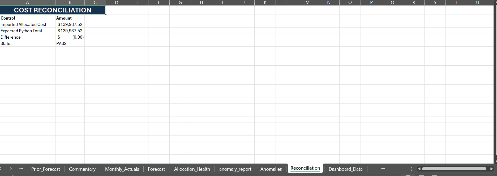
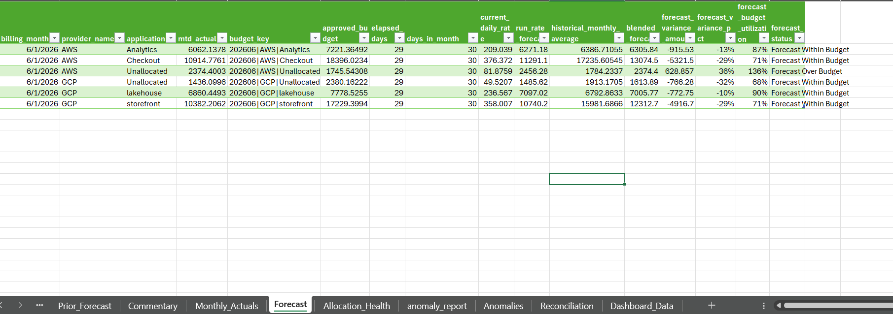
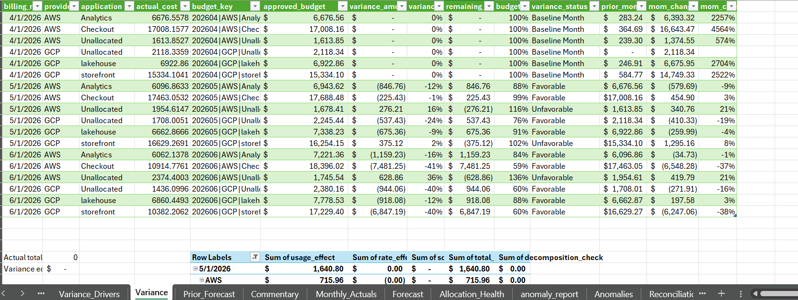
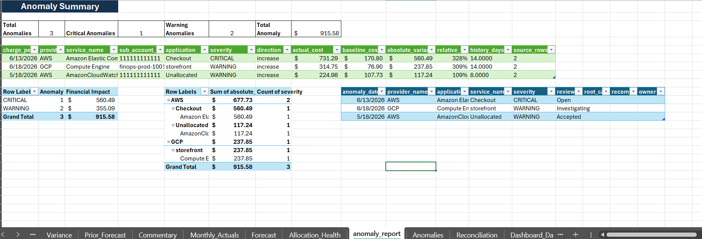

# Multi-Cloud FinOps Cost Pipeline

An end-to-end portfolio project that converts synthetic AWS and GCP billing data into a validated, reconciled, allocated, and finance-ready cost model, with an Excel budgeting, forecasting, variance-analysis, and executive-reporting layer.

## Project Flow

```text
Synthetic AWS billing data
Synthetic GCP billing data
        ↓
Provider-specific ingestion adapters
        ↓
FOCUS-aligned normalized cost dataset
        ↓
Validation and data-quality reporting
        ↓
Source-to-normalized reconciliation
        ↓
Shared-cost allocation
        ↓
Anomaly detection
        ↓
Excel Power Query finance layer
        ↓
Monthly actuals, budget, forecast, variance,
scenario analysis, commentary, and executive dashboard
```

## What This Project Demonstrates

- Normalizing different AWS and GCP billing schemas into one common model
- Preserving cost totals through every major transformation
- Detecting duplicates, invalid Usage costs, and unallocated records
- Allocating shared cloud costs using proportional spend drivers
- Detecting unusual daily cost increases using a rolling baseline
- Building monthly actuals, budgets, forecasts, and variance reports in Excel
- Explaining cost changes through usage, rate, and scope
- Presenting actionable FinOps KPIs through an executive dashboard

## Technology Used

### Python pipeline

- Python
- pandas
- pytest
- JSON configuration
- CSV processing

### Excel finance layer

- Microsoft Excel
- Power Query
- Excel Tables
- PivotTables and PivotCharts
- XLOOKUP
- SUMIFS, COUNTIFS, and AVERAGEIFS
- LET and dynamic-array formulas
- Data validation and reconciliation controls

### Development workflow

- VS Code
- PowerShell
- Python virtual environment
- Git and GitHub

## Repository Structure

```text
finops-cost-pipeline/
├── allocation/
│   ├── __init__.py
│   ├── allocation_rules.py
│   └── allocate_costs.py
├── anomaly/
│   ├── __init__.py
│   ├── anomaly_rules.py
│   └── detect_anomalies.py
├── config/
│   ├── allocation_rules.json
│   └── anomaly_rules.json
├── data/
│   ├── sample/
│   │   ├── generate_synthetic_billing.py
│   │   ├── aws_billing_sample.csv
│   │   └── gcp_billing_sample.csv
│   ├── processed/
│   │   └── .gitkeep
│   └── outputs/
│       └── .gitkeep
├── docs/
│   └── screenshots/
├── excel/
│   └── FinOps_Budget_Forecast_Dashboard.xlsx
├── ingestion/
│   ├── __init__.py
│   ├── focus_schema.py
│   ├── aws_synthetic_adapter.py
│   ├── gcp_synthetic_adapter.py
│   └── build_focus_dataset.py
├── reconciliation/
│   ├── __init__.py
│   └── reconcile_costs.py
├── tests/
├── validation/
│   ├── __init__.py
│   └── validate_focus_data.py
├── .env.example
├── .gitignore
├── pytest.ini
├── README.md
└── requirements.txt
```

Generated files under `data/processed/` and `data/outputs/` are created locally and are excluded from Git.

## 1. Synthetic Billing Data

The project uses reproducible synthetic billing data because the connected cloud accounts do not contain enough spend to demonstrate enterprise FinOps scenarios.

Generated source files:

```text
data/sample/aws_billing_sample.csv
data/sample/gcp_billing_sample.csv
```

Each provider contains 1,804 rows across the April–June 2026 reporting period.

The datasets include:

- Usage charges
- Credits and refunds
- Shared platform costs
- Multiple accounts and projects
- Tagged and untagged resources
- Deliberate cost anomalies
- Exact duplicate records
- Invalid negative Usage records

Synthetic net cost:

```text
AWS:      $71,051.64
GCP:      $68,885.88
Combined: $139,937.52
```

## 2. FOCUS-Aligned Normalization

AWS CUR-style and GCP billing-export-style records are transformed into a common 34-column cost model.

Local output:

```text
data/processed/focus_cost_usage.csv
```

Result:

```text
Rows: 3,608
AWS:  1,804
GCP:  1,804
```

Important normalized fields include:

- Provider and billing-account identifiers
- Charge and billing periods
- Service and SKU
- Resource and region
- Consumed quantity and unit
- List, billed, and effective cost
- Charge category and class
- Application, environment, cost center, and owner
- Allocation status
- Source-file and row lineage

## 3. Validation

The validation layer identifies data-quality problems without silently changing the original normalized records.

Local output:

```text
data/outputs/validation_report.csv
```

Latest result:

```text
Validated rows: 3,608
Errors: 4
Warnings: 265
Affected rows: 268
```

Detected issues:

```text
Negative Usage cost: 2
Duplicate record ID: 2
Unallocated records: 265
```

The errors are deliberate synthetic test records.

## 4. Reconciliation

The reconciliation layer confirms that normalization preserves provider cost totals.

Local output:

```text
data/outputs/reconciliation_report.csv
```

Controls performed:

- AWS source versus normalized AWS
- GCP source versus normalized GCP
- Combined source versus combined normalized

Result:

```text
Source-to-normalized cost variance: $0.00
```

## 5. Cost Allocation

Allocation rules:

- Tagged costs remain directly allocated.
- Shared costs are distributed proportionally using direct positive Usage spend.
- Primary driver: provider, billing month, and sub-account.
- Fallback driver: provider and billing month.
- Untagged costs remain unallocated.
- Credits preserve their negative sign.
- Total cost must remain unchanged.

Local outputs:

```text
data/processed/allocated_cost_usage.csv
data/outputs/allocation_summary.csv
```

Latest result:

```text
Direct:                2,677 rows
Shared-Proportional:     666 rows
Unallocated:             265 rows

Source net billed cost:    $139,937.5178
Allocated net billed cost: $139,937.5178
Allocation variance:       $0.0000
```

## 6. Anomaly Detection

The detector uses a trailing 14-day median and requires at least seven days of history.

An anomaly is flagged when:

```text
Relative increase >= 30%
AND
Absolute increase >= $100
```

A critical anomaly requires:

```text
Relative increase >= 100%
AND
Absolute increase >= $500
```

Local outputs:

```text
data/outputs/anomaly_report.csv
data/outputs/anomaly_daily_series.csv
```

Latest result:

```text
Anomalies detected: 3
Critical: 1
Warning: 2
Total anomaly impact: $915.58
```

Detected examples:

- AWS EC2 / Checkout
- GCP Compute Engine / storefront
- AWS CloudWatch / Unallocated

## 7. Excel Finance and Reporting Layer

Workbook:

```text
excel/FinOps_Budget_Forecast_Dashboard.xlsx
```

Power Query imports:

```text
data/processed/allocated_cost_usage.csv
data/outputs/anomaly_report.csv
```

### Workbook components

- `Exec_Summary`
- `Assumptions`
- `Raw_Allocated_Cost`
- `Monthly_Actuals`
- `Budget_Input`
- `Forecast`
- `Prior_Forecast`
- `Variance`
- `Variance_Drivers`
- `Allocation_Health`
- `Anomalies`
- `Commentary`
- `Scenarios`
- `Reconciliation`
- `Dashboard_Data`

### Budget methodology

The dataset does not contain a real FP&A budget file, so the workbook uses a clearly documented synthetic planning budget:

- April is the planning baseline.
- AWS planned monthly growth: 4%.
- GCP planned monthly growth: 6%.
- Calculated budgets become the approved synthetic budget used by the model.

These values are planning assumptions, not real company budgets.

### Forecast methodology

The current-month forecast blends:

```text
70% current monthly run-rate forecast
30% historical monthly average
```

The forecast is not allowed to fall below cost already incurred.

### Variance analysis

The workbook includes:

- Actual versus approved budget
- Variance amount
- Variance percentage
- Remaining budget
- Budget utilization
- Favorable or unfavorable status
- Month-over-month change

### Usage, rate, and scope decomposition

```text
Usage effect
= (Current quantity - Prior quantity) × Prior effective rate

Rate effect
= Current quantity × (Current effective rate - Prior effective rate)

Scope effect
= Current cost for a service or SKU with no prior-period baseline
```

Control:

```text
Usage effect + Rate effect + Scope effect
= Total cost change
```

The decomposition check reconciles to zero.

### Scenario analysis

The workbook includes:

- Base
- High Growth
- Optimization

Latest scenario output:

```text
Base forecast:          $42,687.03
High-growth forecast:   $49,090.09
Optimization forecast:  $38,418.33
Optimization savings:    $4,268.70
```

### Executive KPIs

```text
Total spend:              $139,937.52
Base forecast:             $42,687.03
Approved budget:           $54,751.02
Forecast variance:        ($12,063.98)
Allocation coverage:             92%
Unallocated spend:             7.73%
Untagged spend:                7.73%
Effective savings rate:        9.85%
Critical anomalies:                1
Warning anomalies:                 2
Total anomaly impact:          $915.58
Reconciliation status:            PASS
```

Forecast MAPE remains pending because the project does not yet have a later completed-month actual against which to score the saved forecast.

## Excel Dashboard











## Running the Project

### 1. Create and activate the environment

```powershell
python -m venv .venv
.venv\Scripts\Activate.ps1
```

### 2. Install dependencies

```powershell
pip install -r requirements.txt
```

### 3. Generate synthetic billing data

```powershell
python data/sample/generate_synthetic_billing.py
```

### 4. Build the normalized dataset

```powershell
python -m ingestion.build_focus_dataset
```

### 5. Run validation

```powershell
python -m validation.validate_focus_data
```

### 6. Run reconciliation

```powershell
python -m reconciliation.reconcile_costs
```

### 7. Run allocation

```powershell
python -m allocation.allocate_costs
```

### 8. Run anomaly detection

```powershell
python -m anomaly.detect_anomalies
```

### 9. Run tests

```powershell
python -m pytest
```

## Refreshing the Excel Workbook

1. Run the Python pipeline so local processed files are current.
2. Open `excel/FinOps_Budget_Forecast_Dashboard.xlsx`.
3. Select `Data → Refresh All`.
4. Update the Power Query source path if Excel prompts for the local project location.
5. Review the `Reconciliation` sheet.
6. Confirm the status is `PASS`.
7. Review `Exec_Summary`, `Forecast`, `Variance`, `Variance_Drivers`, `Allocation_Health`, `Anomalies`, and `Commentary`.

## Automated Tests

Tests cover:

- Synthetic-data reproducibility and required scenarios
- FOCUS schema rules
- AWS and GCP normalization
- Validation logic
- Source reconciliation
- Allocation logic and cost preservation
- Anomaly detection and edge cases

## Financial Controls

- Source totals reconcile to normalized totals.
- Allocation preserves total billed cost.
- Excel monthly actuals reconcile to the allocated dataset.
- Forecast budgets reconcile to `Budget_Input`.
- Variance totals reconcile to actual minus budget.
- Usage/rate/scope effects reconcile to total cost change.
- Executive reporting displays the final reconciliation status.

## Scope

Implemented:

```text
AWS + GCP synthetic billing
Python cost-processing pipeline
Excel finance and executive-reporting layer
```

Not implemented:

- Kubernetes cost ingestion
- Live AWS CUR ingestion
- Live GCP billing-export ingestion
- Power BI dashboard
- Tableau dashboard


These items are future enhancements and are not presented as completed work.

